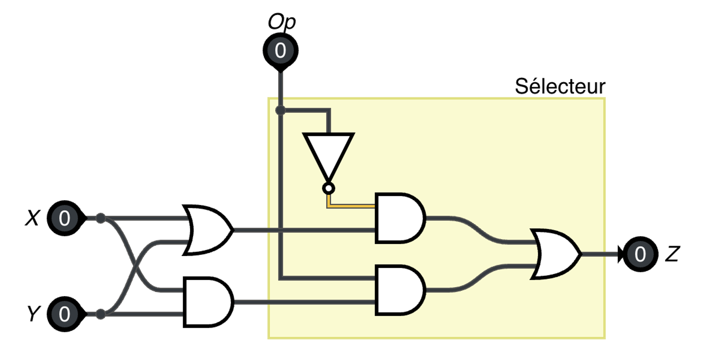

# TP ALU

Nous avons vu en classe que l'unité arithmétique et logique (ALU) permet de choisir parmi un certain nombre d'opérations.

Nous avons aussi vu comment fonctionne un circuit "sélecteur", qui permet donc de choisir entre deux fonctionnalités différentes. Dans l'exemple suivant, le circuit sélecteur (en jaune) permet de choisir entre :

- `X OR Y`
- `X AND Y`




<!-- L'unité arithmétique et logique (ALU) permet de choisir parmi un certain nombre d'opérations. Nous allons voir comment une ALU peut choisir entre différentes opérations (ET, OU, addition, soustraction) à l'aide d'un **multiplexeur**.

Nous allons découvrir comment des décalages et additions successives peuvent constituer une **multiplication** ou une **division**.

Finalement, un **registre** permet de mémoriser les opérandes du calcul. Un registre particulier appelé **accumulateur** permet de faire des additions successives et *accumuler* une somme courante. -->

## 1. Sélectionneur

L'entrée **sel** du sélectionneur permet de choisir entre deux signaux d'entrée :

* entrée 0 : signal lent (période de 2 s)
* entrée 1 : signal rapide (période de 250 ms)

Recréez un tel sélecteur avec des portes NON, ET, OU.


<iframe style="width: 150%; height: 480px; border: 0" showonly="in out and xor halfadder" src="https://logic.modulo-info.ch/?id=CJJr18&mode=full&showonly=in,out,clock,not,and,or&data=N4NwXAHANAxg9gWwA5wHYFNUBcDOZgwA2cMA1gAz5YCeS6YA5ESaQ1CngNoCM55U3AEzkAulACWAEzAB2AMxRUAQwT0GmLACcAl+gAE3NnU3i40wQFZyAX1jEy3KrTXMyRuF1785oidIjciipqGjr65EboJmZgwny24qiUwDR0jInuXHECPmJwJhqMqGxSkIJBqow46IRsIEqEYNwJqI4pzunF7B5gPLxQACx8eQXYRSXSAJyBypUM1bVQ9Y3NUHAArljJqWobWJm9A1ZQMr6lMgMVajj5WOLoDLZ7bTuMewecR-yCAGxnU+VZtdbvdHlAlKhJNsOgwIZIPpZvrkJKhehAFBABnlNpALLY4S8YXCEccfGdUZwID8oBAZNisJAILZUHAtk40gwWftup5TlA5LwxIlIJM1jjJjYoAh1gAPaEc6UyhF8E7kxgWbgAWgscjYezAFkuADNNIhYlAsHAmtZbAB3cSadBcTjyKAWQRiTiGk6XYBIU1IJQAcyUdzQABEakpqE0+DZPQE3dwE+UdZ6JTS6VBONMaZMRCJrEA"></iframe>


## 2. Multiplexeur

Le multiplexeur (MUX) permet de choisir entre deux signaux 4-bits nommés a et b.
Ajoutez les éléments qui manquent:


* Ajoutez une deuxième entrée 4-bits avec un affichage;
* Ajoutez un décodeur (bloc déc. 7 seg) et un affichage à 7 segments;
* Ajoutez une entrée pour la sélection;
* Réglez les entrées pour que: 
  * quand le bit de sélection est à 1, le display à 7 segments affiche le nombre 6;
  * quand le bit de sélection est à 0, le display à 7 segments affiche le nombre 3.


<iframe style="width: 150%; height: 480px; border: 0" showonly="in out and xor halfadder" src="https://logic.modulo-info.ch/?id=CJJr18&mode=full&showonly=in,in-4,out-4,display,7seg,dec-7seg&data=N4NwXAHANAxg9gWwA5wHYFNUBcDOZgCWqADPlgJ5LpgDkRNUKeA2gKzFQCMxxAulAQAmtAMwiAtCIBsDVAEME1GnIYAjArjAAWKCDkAbWsW6caAXyiCCOJKWAUqtKzf1zyDJmGacATB258AsI0IgDs4lrE5lAIAK4AHnYOSnHxHnAsPn5c7PxEtH7iPhAMcLFYBQCckj4MAGYAToiQUFhw2mYWAO4EDegszGJQfvyDOj6coyKswz5TUsMiUyJQYVM6IhBTMyKV81CRvLxmQA"></iframe>

## 3. Sélection d'opérations

Complétez le circuit qui permet de sélectionner entre les deux opérations `a ET b` et `a OU b`.


* Connectez a et b aux entrées de la quadruple porte OU,
* Ajoutez une entrée de sélection pour le multiplexeur.


<iframe style="width: 150%; height: 480px; border: 0" showonly="in out and xor halfadder" src="https://logic.modulo-info.ch/?id=CqY0Qy&mode=full&showonly=in,out-4,display,gate-array&data=N4NwXAHANAxg9gWwA5wHYFNUBcDOZgCWqADPlgJ5LpgDkRNUKeA2gKzFQDsxAulAQBNaAJgAsAWmGcGqAIYJqNWQwBGBXGFFQQsgDa1ixAIzEaAX36ojZSovqM4LdlCPc+gkRHEBmIzPmKKqrqeKIWcACuWKTAFFS0kVgMTGDMoiYubvxCNKyc4gBsplBqGlpyCrSyAAQAogAqAPQA8gCq1UEWsgBO3bLkMXGKsqgC4j195MmOqcKGLnPuqLTe4iYMibRGRmui5lAT-daxtgnd47390yxzHN7evJYrwj4AnBtRtKLE4qLe+wgIgAPQanGiAoHXVLeOaZR5EL4SVjCD5YWisVasAoMABm3UQkCgWDgmjMFgA7gRuugWMwxFBvHw6awoKImcIClBWOzOFACuzoJx2a8oBAmQ8oK9xUYXI9mNtWWyoPLhKzucqjN5WfyNVpRELlRiuQa2FpWGLDSzWFLDZyijweGYgA"></iframe>


Un clic droit sur la porte quadruple permet de choisir son type (AND, OR, XOR, NAND, NOR, XNOR).

## 4. ALU

L'unité arithmétique et logique, ALU (arithmetic and logic unit), est la partie de l'ordinateur qui effectue les différents calculs arithmétiques et logiques.

Ci-dessous vous pouvez voir les circuits logiques d'une ALU 4-bits très utilisée dans les années 60 et 70, le modèle 74181.


L'ALU dont nous disposons peut effectuer 4 opérations :

* addition (00)
* soustraction (01)
* OU logique (10)
* ET logique (11)

Avec l'ALU ci-dessous, ajoutez


* la deuxième entrée (B) avec un bloc d'affichage 4 bits
* un bloc d'affichage 4 bits pour la sortie (S)
* les 3 entrées (Cin, Op0, Op1)
* les 3 sorties (Cout, V, Z)

Ensuite, testez les 4 opérations. Montrez une soustraction.


<iframe style="width: 150%; height: 480px; border: 0" showonly="in out and xor halfadder" src="https://logic.modulo-info.ch/?id=CqY0Qy&mode=full&showonly=in,out,in-4,out-4,display&data=N4NwXAHANAxg9gWwA5wHYFNUBcDOZgCWqADPlgJ5LpgDkRNUKeA2gCzFQCMArMQLpQCAE1oB2AEwBaUdwYAjArjCsoIAIYAbWsU46aAXyhCCOJKWAUqtY6Y1ryDJmGYBmdlHHF+gkTQBsENKcBkYmSJxklNQ0Nkh2DoxwLJwuHDzewrQQxJIQLiGaAK7mltFFjknO4qkeXgJEtNyckn7BUHCFWM7+Un6yUACc4lB+oiN+fPqGAO4EAE7oLMx+wwECyy4jA+t+KqLey9xQopzrElBNZ5vc4mcq3C5nR9ysZ8PZV1AQp1DMoioQW6-GRfR6TIA"></iframe>


## 5. Addition signée

Interprétez les nombres binaires comme des nombres signés. Vous pouvez configurer l'afficheur 4 bits avec le clic droit. Complétez l'additionneur 4-bit et montrez que l'addition de -2 et -3 donne bien -5.


<iframe style="width: 150%; height: 480px; border: 0" showonly="in out and xor halfadder" src="https://logic.modulo-info.ch/?id=CqY0Qy&mode=full&showonly=in,out,in-4,out-4,display&data=N4NwXAHANAxg9gWwA5wHYFNUBcDOZgCWqADPlgJ5LpgDkRNUKeA2gGzFQTEC6UBAJrWIBaAMwMARgVxgALFBABDADa0AjBuI0AvlH4EcSUsApVa+w8sXkGTMM02cefQTVnCA7AwBOi-QA8wYTViXRUAV2NTahoI2zgWACZRDjUU3iJaCGCIBjhwrHUATmFEgFYdXQB3Am90FmYOWV4HKDKWxKhWFtEoDxaOCBa1KCKOqBCeibVubm0gA"></iframe>


## 6. Addition 8 bits

Pour additionner un nombre à 8-bits, il faut combiner deux ALU 4-bits. Dans ce cas il faut connecter Cout de la première ALU avec Cin de la deuxième.

* Complétez le circuit pour afficher l'addition de deux nombres binaires 8-bits.
* Ajoutez une entrée pour soustraire deux nombres.
* Montrez une soustraction correcte, dont le résultat est plus grand que 30


<iframe style="width: 150%; height: 520px; border: 0" showonly="in out and xor halfadder" src="https://logic.modulo-info.ch/?id=CqY0Qy&mode=full&showonly=in,out,in-8,alu,display-8&data=N4NwXAHANAxg9gWwA5wHYFNUBcDOZgCWqADPlgJ5LpgDkRNUKeA2gCzFQCMnxAulAQAmtAEysAtAGZODAEYFckKCACGAG1rEtxHjxoBfAak5lK1OqgZMwbDpJF8BwmgHYJEGVHmLoqjTW0tHmIDKEECHCRSYAoqWnDItRVyKzgWYK4efiFaeykATjkFPAhDBKQTGLN4iKQklMY0m3YOThdHHJoANi7xF0kin0N1AFdo2PNR1JYRBy5JDtRNcT0oOBGsWm4Vl1DRyonaKcaZuckuxdpWCHEAVggGdc2aW-zxLtuDQwB3AgAndAsZhiKD2fjA26gyTgkRdUGsGEuUG3GHQc4w-KglzghagiA4zig-LgtpQe4w1hQRwQrgwuEiRGg1FQa4YlnEqDMXG3anSMmcEmEnokkRQLrYzmcSRi-GSyldDnMNws8EuSEozkuOFdXi8fRAA"></iframe>


## 7. Carry et Overflow (V)

L'ALU possède deux sorties pour indiquer un dépassement de plage de résultat. Le résultat affiché est alors décalé de 16. Ce cas est signalé par l'ALU à l'aide de deux signaux de sortie spéciaux.

* C (carry) signale un dépassement pour des nombres non signés,
* V (overflow) signale un dépassement pour des nombres signés.

L'addition de deux nombres naturels (0 à 15) peut produire un résultat de 0 à 30.
L'addition de deux nombres relatifs (-8 à 7) peut produire un résultat de -16 à 14.
Dans certains cas on aura donc besoin de 5 bits pour représenter correctement le résultat.


Pour les nombres non signés (première ALU) :

* Choisissez des valeurs a et b qui produisent un dépassement (C = 1), et donc un affichage incorrect sur une sortie de 4 bits.
* Ajoutez en plus un affichage 8 bits et connectez-y les 4 bits de S et C comme 5e bit, pour afficher le résultat correct.

Pour les nombres signés (deuxième ALU) :

* Ajoutez 2 entrées 4 bits et 1 sortie 4 bits.
* Ajoutez 3 affichages 4 bits configurés (via menu contextuel) en nombres signés.
* Choisissez des valeurs a et b négatives qui produisent un dépassement (V = 1).
* Ajoutez un affichage 8 bits configuré (via le menu contextuel) en nombres signés, et connectez-y les 4 bits de S et C comme 5e bit.

**Attention** : Dans ce cas vous devez connecter C également avec les 3 autres bits (b5-b7) pour faire une propagation du bit de signe et traiter correctement le cas des nombres négatifs.


<iframe style="width: 150%; height: 540px; border: 0" showonly="in out and xor halfadder" src="https://logic.modulo-info.ch/?id=CqY0Qy&mode=full&showonly=in,out,in-4,out-4,alu,display,display-8&showonly=in,out,in-8,alu,display-8&data=N4NwXAHANAxg9gWwA5wHYFNUBcDOZgCWqADPlgJ5LpgDkRNUKeA2gKzFQCcxAulAQBNaARggBaAEzCGqAIYJqNWQwBGBXGAAsUELIA2tYkekBffqmFlKi+ozgt2UYdz6DaEgGyTOM+YpWq6njaugY0xsQ0ZgIEOEikwBRUtDFxerLkDExgzMJGXLz8QjQSEpKsUVCpSJaJ1imxSOmZdix5HM6FbjQAzMRiPT2VcACuWAlJiqNYWfY5EtxOml3FPawDEIEamtGNElbJNNXNsyw9AOwdy66rnGKaEsNjtZO006fzixLsN1o9UHIFLQAMLTAAEAAoAE7oLCYEboMECRE4OBQrAEdAASieWH2dUO71a82WUFYHhWkH+gMUADVIXBaegoQAzPRwADuOLM+hGE3qSj0Iw+uQgVy6qEMYjyDGmImE0vOlV5LwFvJFnSgDwltE0mjErE0srGtFY6w8pig6RU6D0-MO1ttGr6UAkhThAA8sLRUIgVDCcGDfagwTgCABzVAAS5wlUdelVDtkNr0GvyC3d6C9Pr9AdDEejsZMZg5BADOVFUEKuU4Tj4zDdrvrUigPXroldEnbtYkbagDY4Ek0zeErtYzY8Wub5zJzegHmbtfOE9b1YkM56wjnra7-YWrb7uVHa3bElbC-7wn+F3b2h6EHbx84p611avWq3l+0D3bM80h9YWsIDbHgTCAA"></iframe>

[Solution](https://logic.modulo-info.ch/?id=CqY0Qy&mode=full&data=N4NwXAHANA9gDgFwM5mDATgSwOaYHZgDaADFAMwBMAugL5QDGMAtnDHgKZ7Kr7GoIBPOOzAByfKKisUhAKykAnMSpRMAEzEBGCAFoKmyXgCGTEaKOSARpm4AWKCCMAbLcWIG6+TfyFmJUmBl5KE0lFXUxCgA2PQVDEzNLKxsUe0cXUU13YlE6NUwkOD5gQWExfMKnIwFJaSIsxWVVDVEKCj1ZXKgKuG8S33KCuCqagJkGkLDmsTJiHTIyLpgAVwRi0rMVhFrAogolENsmiNEyWXmIZLs8oYofMtEekZ2ZMgB2Uk0j8JayBR1bBQlqs+hsxFsXnsDhR5D8wLYyFBjKYxABhLYAAgAFOh2AhOMt2Bi1ESkBgEJh2ABKYEIO79B4QsZ7I5QWRRY4aCCI5FmABq2JgfPY6AAZk4YAB3Gl0ZzLdYDcxOZaQwjaT7fVQEURzLKSLZaTQ6TRvLpy0GKuWq0KkQHHbW2Ww6WS2fWrMSyc5RDxa+lg8R4VVRWTkD5wwhkeyiKLtKKulTWOwOZyuPWePBke5+QPMwjBqC2MPTaNey5QROpZMZTQNLo9TMMsxParWzQh96csRRf5vIFQdBGfIADzAxuIN0Ktizg0qLdzNZDhc7ojeZB0byikgHw9HWToWwb-qZdUIMMXFGXbzeOggOXLKXhE7gsmnjyGz1zkdtF-DEE0UAgCgAPsCBZBUbdMBHMcnyiV9m1GE9ZAvcgphOCAYgURZ724aAIKgvduiGN44PfOcT1sA4vmXBQnSyAxsJQCA6CqSx2CcBUHhYtjrVmKAfygfEhwQMQ8GYSxcSQDFRLwDEkBwPAAEukC6LinAtTijFYpxrTcPipkE4TRFEphxPYSS5OwRTlJoOhJUwCSiDVaAmjVBQQhUU9SGoKBT3-MgPO0PjvNcvj-J85CKFsDz9D4sDwqiAtoreNlougKJorct5ooS2YkvITRUvIYL9nIMK1T8uK1SAsh0p8zREXeAL7DICAAr8hQAqAzU1URWwCrq+xAQC5KEQ82Q3O5DzIwLKKfJjAtKqiXrarzQasrmxdWrmhKKI8qJkthOboFkfqI3sbs9qAos80RN5TrjKBez2kNVz2hK3lmvNkreRboA3MaXvWuR3q2uRvo6nzZGgW8AYA072QA4LZGSiBPqhgDKs9ACVoRiAgeRgDQfRiAIbzf8pjJqAFHu8ngu9KmyprKnPs0ICFEq+qqZWr4qaBk0qda2ggA)


## 8. Multiplier 1x1 bit

Les règles de la multiplication 1-bit sont très simples. Voici la table de vérité.

| a | b | a x b |
| --- | --- | --- |
| 0 | 0 | 0 |
| 0 | 1 | 0 |
| 1 | 0 | 0 |
| 1 | 1 | 1 |

On voit tout de suite que ceci correspond à la porte ET.
Dans l'exemple ci dessous vous voyez une porte ET pour multiplier a et b, les deux ayant juste 1 bit.


* Vérifiez le bon fonctionnement du multiplicateur 1-bit
* Ensuite, utilisez 4 portes ET pour créer un multiplicateur **a** (4-bits) fois **b** (1-bit).
* Basculez b entre 0 et 1 pour vérifier si votre circuit fonctionne correctement.

<iframe style="width: 150%; height: 400px; border: 0" showonly="in out and xor halfadder" src="https://logic.modulo-info.ch/?id=CqY0Qy&mode=full&showonly=in,in-4,and,display,gate-array&data=N4NwXAHANAxg9gWwA5wHYFNUBcDOZgCWqADPlgJ5LpgDkRNUKeA2gOzFQCsxAulAQBMwHVAEME1GqIYhRAGzABGAL79UispUn1GcFuyjs+gsABYoYibQBGNVUQBMmqrR1MwbDg+K9+QmgBsALQAnAyWktJQ1gS4ZlCyCjTEij52agDMztqoDO6eUA4hviapFuKStgnySqpwAK5YpMAULjQNWHl6Hg5lASVCnOVWUgAEAB6jtqoCBDhIza2Ss-NyouRdLBnchT7G-oqKQYqm4RW0ohNT6aKoAotaF3ebHicc-caor4V8HWAZylUAHcCAAndAsZgcRR8ZjmBywjJcHg8ZRAA"></iframe>

## 9. Multiplier par 2, 4, 8

La multiplication par une puissance de 2 est facile: il suffit de décaler les bits, pour qu'ils occupent tous une position plus à gauche.
Le circuit ci-dessous calcule 2a en décalant d'un bit en direction du poids fort.

* Complétez le circuit pour calculer et afficher 4a et 8a : de combien de positions doit-on décaler ?
* Vérifiez avec a=5. Votre affichage devrait montrer 10, 20 et 40.


<iframe style="width: 150%; height: 400px; border: 0" showonly="in out and xor halfadder" src="https://logic.modulo-info.ch/?id=CqY0Qy&mode=full&showonly=in,display,display-8&data=N4NwXAHANAxg9gWwA5wHYFNUBcDOZgCWqADPlgJ5LpgDkRNUKeA2gCzFQBsxAulAQBNaxALQBmBqgCGCajSkMARgVxhWUEFIA2w4gEY9NAL5QBBHElLAKVWmYtap5BkzDMATO47c+g2qxEDJRU8aGlZWncFE3skPTJKOVjHZ0Y4FgBOb15+IRo9d0CAVmNTcyR3BNsaZKcXdLdPDj0fXNoWkXcJKGVVMJk5VmiyizEqpPKU+pYmqHdWvxp3ALFDHpDIKHC5CGiTAHcCACd0FmZm9z5mPSg9MSv3W9YrsVuiq453qGuuB6gAdheUAgPB4RiAA"></iframe>

[Solution](https://logic.modulo-info.ch/?id=CqY0Qy&mode=full&showonly=in,display,display-8&data=N4NwXAHANAxg9gWwA5wHYFNUBcDOZgCWqADPlgJ5LpgDkRNUKeA2gCzFQBsxAulAQBNaxALQBmBqgCGCajSkMARgVxhWUEFIA2wgIzFdNAL5QBBHElLAKVWmYtap5BkzDMATO47c+g2qxFdQyhlVWhpWVp3BRN7JF0ySjk4x2dGOBYATm9efiEaXXdAgFZjU3Mkd0TbGhSnFwy3Tw5dHzzaVpF3CRCVPHCZOVYY8osxauSK1IaWZqh3Nr8adwCxYND+qAi5CBiTAHcCACd0FmYW9z5mXShdMSv3W9YrsVviq453qGuuB6gAdheUAgH1uIO+N10mT+XiB7l0oPcgIh83BHnm0O+rzEvB4RiAA)

## 10. Multiplier 1x4 bit

Au lieu de la porte ET utilisée précédemment, on peut utiliser un multiplexeur 8x4 pour faire la multiplication d'un nombre **a** (4 bits) avec un nombre **x** (1 bit).

Nous pouvons représenter un nombre binaire **b** de 4 bits par une séquence de 4 nombres binaires de 1 bit : $b_3 b_2 b_1 b_0$. 
Chaque bit $b_i$ a un poids de $2^i$. Il peut donc contrôler la multiplication de son poids ($2^i$) avec $a$.

* $b_0 \cdot 2^0 a$
* $b_1 \cdot 2^1 a$
* $b_2 \cdot 2^2 a$
* $b_3 \cdot 2^3 a$

Pour compléter l'opération de multiplication 4x4 bits, la dernière étape sera d'additionner les 4 nombres.


Complétez le circuit avec :

* deux entrées que vous appelez **b2** et **b3**
* un affichage 8 bits qui affiche 4a sous contrôle de b2
* un affichage 8 bits qui affiche 8a sous contrôle de b3

Essayer de multiplier deux nombres, par exemple a=5 et b=5 (0101). Vous trouvez le résultat de la multiplication en additionnant les 4 nombres affichés.


<iframe style="width: 150%; height: 450px; border: 0" showonly="in out and xor halfadder" src="https://logic.modulo-info.ch/?id=CqY0Qy&mode=full&showonly=in,in-4,display,display-8,mux&data=N4NwXAHANAxg9gWwA5wHYFNUBcDOZgCWqADPlgJ5LpgDkRNUKeA2gCzFQBMAzMQLpQCAE1rEAtNwaoAhgmo1pDAEYFcYVlBDSANqICMxPTQC+g1HrKV59RnBasAbBwCs-KHABOBTFlo4GwmDcAJxQMnK0SsQMWrp6pkScllS0NkxgzNyuUK4Cnt7YfgEiBtDh8kpGmjpg8VBCBDhIpMAUKTQNTdrS5AzpzMEcPG6BNKzBYs6cJvWNSBatVrSdSN29tizOg1DcTgKjrGJ6VSpqEKYrSYvtK2t9dhmsEBy7IyI0epxHwcqqeOdQBAAVwAHi02vJgSD7iw9Nk9M99qhaJwvrwGHAgb4aNw9BJWAwAGYeRCQKBYODqUxQhYQ2hQmEZTjsKAIkbImjObhiBxVTHYhxfBzOIkkhBkilUwGgq50mgMjYZLIcNlI2gAdmcYggkncWNoEEOEHVotJ0ElrGpoO4yUhoMZbCcrMRZlowS1Bl1-NoBkOBhNUGJZvJlMtpgA7gQPOgWMwhg4BMw9Fx1YnOFwIInuFxgomOONE8nclBmOnnHoszlOHmcqmS0XMyWy7mS9m9iWOOqW0moC7S72K63e9WO1Bgt3kwY3P2DIPMqziCPMqFPYXiNAdWuNKw184cmuHFAE-XiOqoHXmIbWdxExA93odyWIIe4bez3oE3xjEA"></iframe>

[Solution](https://logic.modulo-info.ch/?id=CqY0Qy&mode=full&data=N4NwXAHANAxg9gWwA5wHYFNUBcDOZgCWqADPlgJ5LpgDkRNUKeA2gCzFQBMAzMQLpQCAE1rEAtNwaoAhgmo1pDAEYFcYVlBDSANqICMxPTQC+g1HrKV59RnBasAbBwCs-KHABOBTFlo4GwmDcAJxQMnK0SsQMWrp6pkScllS0NkxgzNyuUK4Cnt7YfgEiBtDh8kpGpkIEOEikwBQpNDV12tLkDOnMwRw8boE0rMFizpwmUK1IFo1WtFPtnbYszr1Q3E4Cg6xiekZQKmoQ1bVISbPNCx1ddhmsEBwbAyI0epy7wcqqeMdQCACuAA8Gk15ADATcWHpsnoHltULROO9eAw4P9fDRuHoJKwGAAzDyISBQLBwdSmcEzUG0cGQjKcdhQWEDBE0ZzcMQOfZojEOd4OZz4wkIYmk8l-IHnak0WnLDJZDjM+G0ADszjEEEk7nRtAgOwgKqFROgYtYFKB3GSYKBdLYTiZcLMtGC6oMWp5tAMOwMhqgBONJLJZsmp1YVvmp0Wto2znWm0EIkyKvW0CG4lYgoEhx+JzqznDLUj1zlzE4zljTy2LwcKrEKtxB2+kASqEtF2sqFtDJcbnyPiKCcgZVkFXGmh0YHiZjD7dSnZL0J7eS8-Zo-kHEFC5UikmMpgA7gQPOgWMw+g4BMw9FwVZfOFwIJfuFxgpeOMNL9fclBSzk9E+ck4N8clvH8v0fH971WAD4zPKAVVfMCoEdX8IH-H9nwgICfw4YJEKvJliDcX8DHQzJCOwzJQjdT9iGgTVaI0VhaNjZxaIcKALzA4hk1A5g9SZbhLwgWM9GYn8IA46FhOTPQuP46AuWE0JeEvPkoHYNTn1YMiHCYyiBQ0oSMOvFViO4e8VTI7hnxVSjuA0FUhL4YwgA)

## 11. Multiplier 4x4 bits

La multiplication 4 x 4 bits nécessite:

* 4 multiplexeurs pour la multiplication 4 x 1 bit, vue au point précédent
* 3 additionneurs pour additionner les 4 opérandes décalés


Pour multiplier `0101` x `1001` = `00101101` (5 x 9 = 45) nous écrivons en colonnes ceci :

```
1     1001
0    0000
1   1001
0 +0000
----------
  00101101
```

Cet algorithme peut être exprimé mathématiquement comme

$$ produit = \sum^4_{i=0} (b_i \cdot a) \cdot 2^i $$

Modifiez a et b dans le circuit multiplicateur 4 x 4 bits ci-dessus vérifiez que vous obtenez bien le produit de a et b. Faites une capture d'écran avec la plus grande valeur possible.


<iframe style="width: 150%; height: 800px; border: 0" showonly="in out and xor halfadder" src="https://logic.modulo-info.ch/?id=CqY0Qy&mode=full&showonly=in,in-4,display,display-8,mux,alu&data=N4NwXAHANA9gDgFwM5mALxjAtmAnABgF8oBjbOGAOwFNLlUBLS-VBATzmrAHInuoKKANoA2AIwBWKABYJAXVgAnBrQQ8k-BgBMeY3AFoATIf6UAhli7cz-AEYN60qCDMAbXfnxjuxJmNYcVnwCMMJiYvgy8koqdOqaOtyGAMxGIqYWVrZ2DihOLu7cXl4+UFoMSHAswOycPOWVrmZs-IJgQrKRAOwECjDKqvFQ2rqS+mLGOfQQxA1w-jWB9RVwTS0hwslSuNH9sWrcAO4JutJi49LSpXOGAXXcc2utoe0iO1A7CiPcYrIXEKU3ABXaq1KzA57CCRdKTJCC7AZxbgaYaUXQpcbJZL8GBAg5iZLSC74QGuIELME8CEbdoSfBSCSSPqIg4opi6ESGcZdEywPG6LqpMQ9UlA26Le7UtodLZQER05n7IbspL0oySHH8pJiERGSbELBAgAeoKW3ENRshr1kUEMnkVg2RmjRRX0AL5BwME34ADNFNhIFAEDAwE5bDAEMGcAhFEDqAbjRSzRarUI6ZFDCJ8A6kWy0UIfkL3UkukZcNw+lrkvh9Fjff6cNBg6GoOHIwGY3GE0bxZTzcbU1tYfCc6znTxCfppLzcQdpKlpOkoH6A02Q2GI1GwJ341ALck7lYUzShIYbYzszFHXmeNJSxIJJqDhJdRJy8uG4Hmxv29HY-HiEOBhFGoYQhD0GQFFPSJolPMQ5Sg4woC6KCIOFKBQAYMx2lEG1wikI4KygDoIEifCoEIuQ5EIRCyOgTDsKEURDG2AjjigxdIneSjqMQ+DDC6DCQCwnCsykUiKPY4jLkiCSeJo4ikMMejhMYjo7TlNiK144jqygCYUN0+CJggKDkkMfTDFwMzkn06tULIlJUOMs9UIsiZYLPW1cCEkSmMkDMsyohShB88iGNE+FbTpCiNCgkQoreSInWC1DCX0nVfLUkQ9MXAi4uInLIiS2LtJClJ9LORCnF+QxEKkX5kkQkRKukVCwtkWjKpEPjKsM093OkUziIguEstEvDJEkoihCxBqpvkrrkh8iKmM5VjprMqbuPYnS4JkSJVtEekoDkqTT3eM6ysQiyznGpiBKkeVNr2gkGs5NKWp1JqRuSQSdTa6TbJ1HrpJqkR+rwhKOK+t56pkCyjoCqA4XkV7BQywSjofBkopS4icblAhStSkbpDI56jrylHnvxjpnvnfKZokFiZFlFL0acO1YOFKQ7VB8Cuhau1+pfW18GsgnBMMCIoIkaAZbEOWfJluqRp8xl7tw+atJunWXvKmDEdU0TWZ2mbuY+XW9plqAJFso6xNO5LzrEKKrtJga7acJHntpuL0ZV-AVL82b3mkbiCrDhl-Zm2QY6Zz2Za+t2+P+vQ+OgCZLzgsKZZu9ykKO8ynr0umS6J5KA-KlqHy15GLyT2yQ7U5G7WzXjqKAA"></iframe>

## 12. Diviser par 2, 4 et 8

La division par une puissance de 2 est aussi simple: il suffit de décaler les bits, cette fois-ci vers la droite. Mais que faire avec le bit de poids plus faible, qui n'occuperait maintenant plus aucune position ?

Et bien, ce bit-là, il représente le reste de la division par deux, notre cher opérateur modulo `a % 2` !

Pour diviser par 2, donc, nous décalons d'une unité, et nous obtenons :

* La division entière (`a // 2`)
* Le reste de la division, l'opération modulo (`a % 2`)


* Ajoutez deux affichages 8 bits pour la division par 4 et 8
* Ajoutez deux affichages 4 bits pour le modulo 4 et 8
* Ajoutez les étiquettes (`a % 4`, `a // 4`, etc.)

Par exemple pour `43 // 8` vous devriez obtenir 5,
et pour `43 % 8` vous devriez obtenir 3.


<iframe style="width: 150%; height: 450px; border: 0" showonly="in out and xor halfadder" src="https://logic.modulo-info.ch/?id=CqY0Qy&mode=full&showonly=in,out,display,display-8,in-8&data=N4NwXAHANAxg9gWwA5wHYFNUBcDOZgCWqADPlgJ5LpgDkRNUKeA2gCzFQCMAbMQLpQCAE1rEAtAHYGqAIYJqNGQwBGBXJCggZAG1HFO+-ZxoBfKEII4kpYBSq0LV7TPIMmYZpwDMHHv0EiNBBinACsKmp4EGaOSJxklAqxzq6McCwATBkcvALCtNliGV7ScgoyAKQZpuaWSBkJ9jTJLm7pHsW+Ev75NBmsYl7GUKrq0LLytDIA9NPVJmYA7gQATugszBwQAp5QAJw7GVz+zF5cnDusXBk7oVxeO9xcrDsSXKE7HNk7nFD9h38PlBTn9uJc-hJbn9tsCnhkDsC3j4+HwTEA"></iframe>

[Solution](https://logic.modulo-info.ch/?id=CqY0Qy&mode=full&data=N4NwXAHANAxg9gWwA5wHYFNUBcDOZgCWqADPlgJ5LpgDkRNUKeA2gCzFQCMAbMQLpQCAE1rEAtAHYGqAIYJqNGQwBGBXJCggZAG1HFO+-ZxoBfKEII4kpYBSq0LV7TPIMmYZpwDMHHv0EiNBBinACsKmp4EGaOSJxklAqxzq6McCwATD5QEqECwrQZ4lnScgoyAKQZpuaWSBkJ9jTJLm7pHlm+Ev4FNBmsYl7GUKrq0LLytDIA9NPVMXWsjUl1KW2Z2Rnd+YFeGYMAnBFjUBPlAASz56w1saHLDqutaRscXtsBtKwDocOjUacylNLtNzhBbnUvA9mk9Uu5mO9QlAtj1AqF9qFwoDJopzhVrhCrNxoS04e0EbkoF5eDtaKFuGJQkdsRd8eCTGYAO4EABO6BYzA4EAEnigBxFGS4-gRXE4ItYXAyIqR3hF3C4rBFEi4eSgguR0s4yM1eslGV1Moy3HlyIkyuRwr16oy4r12p8EqpSr1XipXhtXhNzCRXgt6upWqpdp9UG+NtYFqRrGtTtj0eY2tYjv16JFRtC-r1HHpeagoXTktCwr4JiAA)

## 13. Registre

Le registre que nous allons voir plus en détail dans le prochain chapitre permet de mémoriser une donnée.
Avec un coup d'horloge (clock), les 4-bits de données sont mémorisés.


Ajoutez un deuxième registre, décodeur et affichage à 7 segments, pour permettre d'afficher un nombre décimal de 00 à 99 ou un nombre hexadécimal de 00 à FF.


<iframe style="width: 150%; height: 450px; border: 0" showonly="in out and xor halfadder" src="https://logic.modulo-info.ch/?id=CqY0Qy&mode=full&showonly=in,in-4,7seg,dec-7seg,reg&data=N4NwXAHANAxg9gWwA5wHYFNUBcDOZgCWqADPlgJ5LpgDkRNUKeA2gKzFQCMAzMQLpQCAE1qdOAWk4AWBgCMCuMFKggAhgBtaxbZxoBfQak5lK1OqgZMwzTtqjdbA4WE6soqVQjMx1cGAGsGAhwABQBXHAALACEwrCw0MCwAJzD0AyIAJhMqWnpGOBZ2KEzeJxEablZxbgg5BTwpAxoAdhx0AHNiGhyzNs7LQuspWy4pfkEKzJaamQNkztJgClyaBY7BlkzMjh4Joi1xADYGODjaGdt9KCF0GCWVs1uYcX6NgpZuXi4yw1EjyQATlO5xoO3EmROegMAHcCAsWDZOPYBDZMlApKieFBWFjlEcsW4JswWlwCVBmNBOC1UYCuBAsbtAaidiUaRTMsjMgyOejMsyOdx7MTMsoHCy3NxMiyjvZuHw+HogA"></iframe>

## 14. Accumulateur

Un accumulateur est un registre spécial qui *accumule* une somme. La sortie de l'accumulateur est reliée avec l'entrée A de l'ALU. À chaque coup d'horloge du registre, le calcul `acc + b` est effectué et affiché.

Par exemple dans le circuit ci-dessous, l'accumulateur contient 3. Au prochain coup d'horloge, l'entrée b qui est 2 y sera additionnée. Ceci permet de calculer une somme courante.


Voici un exemple typique, calculer la somme 1+3+7.
En Python ceci correspondrait à :

```python
acc = 0     # clear
acc += 1    # add
acc += 3    # add
acc += 7    # add
print(acc)
```

Avec le circuit ci-dessous ceci correspond à 4 étapes:

1. **clear**
2. b=1 et **add**
3. b=3 et **add**
4. b=7 et **add**

Connectez les entrées **clear** et **add** au bon endroit et calculez 1+3+7.

**Attention:** tenez le bouton suffisamment longtemps pour laisser propager les signaux jusqu'au bout.


<iframe style="width: 150%; height: 450px; border: 0" showonly="in out and xor halfadder" src="https://logic.modulo-info.ch/?id=CqY0Qy&mode=full&showonly=in,in-4,display,alu,reg&data=N4NwXAHANAxg9gWwA5wHYFNUBcDOZgCWqADPlgJ5LpgDkRNUKeA2gCzFQBMnxAulAQAmtYgFoAzA1QBDBNRoAjBgoK4wrKCGkAbEcQCMxGgF8BqfWUrz6jOC3EQO4nvzgAnApiy1UDIWHEAdigZOVoYbXRpNz8cAAUAVxwACwAhBKwsNDAsNwT0UyJOSypaGyYwZh4nFwFhBxDZeWlBQVjElPTM7Nz800ECHCRSYApSmgGh7WlyBgrmAE4Obj462lZA0QBWI37BpAtRq1pJpGnZ2xYtnih9QNX-Gi39bdYTKFPio-HT87m7SqcJa3e78R7icQSABs7x0CRGY2a2gS-xY1RBD1Q61E+jeUDgGVo+i2ok4+lhMBgJXkbnQAHNUZUHBw7pjaNxSRAGATvDQgRJOAx4NgvLRJKZpgp0NoEccaJLpYzmMyoKCoFh0AAPXnSSkJBAJaYahIxYymADuBFpLGYxK4W34tqhXChjruXECbugnAgjo4GzdUFYvqgVSDC0d4igO0dQOj+kjHGukf00fEkc40dYfqgIdtUAjoczhkjtwTRYWQagoAI0kqbHYt0bNHNNEdrEbOygLbboeJW2jHB7vF4xkT0erIFr9dYXf0UKHvnbXebrbds6DQ7XfY3+kM3bXo5TUGdNbrzDYC9ujgPvcvTi3d-04gH4kfbpftzft5HY9DzlVSdpwvDZlmId9Q1ArgINtTgBxuYc+zg24u2HI8+1fdM+2dcRsz7YIXy9KBxFdUcgA"></iframe>

[Solution](https://logic.modulo-info.ch/?id=CqY0Qy&mode=full&data=N4NwXAHANA9gDgFwM5mDATgSwOaYHZgDaADFALQCMEAugL5QDGMAtnDHgKZ7Kr7GoIAnnA5gA5PjFQ2KQgBZSAJkXFqUTABNxxMgGYpeAIbNRYgEZSzmHnKghDAG23FiFMfXwUBw05OkxZXQhSXRU1DEwuBHE8KU0wXQB2KCMTcQYHDkN0OKQABQBXJAALACEChAR2MAR0Ao4PPEVvEXE-GSIVELD1LSCU41NDDQ1cwpLyyura+voNTCQ4fmAhVrF5xYdDQSkOwgBOJR74sTlEsgBWYncoDbgvFZ9xO62d-1kLlSgKRNVe8QuFEuchud2ajzWL22uwCnUO31+ahOul0egAbDdHAVlqshg4CjDZF0EX98OI5JQQbAKuIKBcyIo3PRDAwGC1TOgONhCUQgqQfqSCGJlAyIFIYDThfs9IoblszBwHDinmJ5YqeYQ+VBEVAEBwAB7RMQshgFZgFLZ6go5ehqhwPXHiO0a3R0qBBC5qPWG8QAJQAl9hMugAARmENIa0highsgAPhDww0sYTnKDHFD4cjod0KcTIzzcAKCwjUcSKaTADp3PQAO6YTmyQhuxSeqDNtFQRRotTN5KKRK9qhdmjt0hnIdQOSjwiKKf7Xu6KBXXuKfbLiiL0ifRcUZe6Rdzi5yXukGd7hftucUP6a76bq-r2ygTCGIjyBTfT9iWtiXtyT8rigH8-3bOkLmXUgQOoOgt2XKAXzfQh5CAig0Sg2J-yA79fyHOQIJw0Dm3w+8oNw2D21dKBO0Q985HQ75gmA3D23okIyKIihdAg3QOKHbjvl45i-wozU52SWjkLOJQXGE-9fi7PiwNbRS5OUiC6T40S3RRIdO10E8wOSbih2gXQe0o6BlEXfsTzoIA)

## 15. Incrémenter/décrémenter

Certains appareils électroniques ont très peu de touches et on doit utiliser juste deux boutons.
C'est le cas pour régler la température ou le volume.


Compléter le circuit pour les boutons

* **up** pour incrémenter la valeur (clock)
* **down** pour décrémenter la valeur (clock + soustraction)
* **clear** pour mettre la valeur à zéro

Attention au délai de transmission par défaut de 100 ms. Il faut soit appuyer plus longtemps sur les boutons, ou diminuer ce délai.


<iframe style="width: 150%; height: 450px; border: 0" showonly="in out and xor halfadder" src="https://logic.modulo-info.ch/?id=CqY0Qy&mode=full&showonly=in,or,dec-7seg,reg&data=N4NwXAHANAxg9gWwA5wHYFNUBcDOZgCWqADPlgJ5LpgDkRNUKeA2hMVACzHEC6UBAEzAB2AKxRUAQwTUaMADbpJAJwYEcABQCuOABYAhLVixowWZVvQBffqgCMZSrPqM4LNlADMANl78hwtBSMrQCcADuqGqaOgZGJqhmFta2AEyOVLQuTGCs7J6pfoKQqRLSslpI0dp6hsam5pY2NMI46ADmxDQZsq0dDDnMonbsdmx8xTSpwgC0nhw0NnDKpMAUmTTLA265qSNeokWJzMIAnFDjUHBGkHY2yh2r67IP7dssntxQdsJHtMQzbwMa5YWizEYMeDYTCgmgLGwCdAwJ5OUJImZ9N6uFgcT7fX4TRI0OzeGZ2U7Am5TAGpIE2STyLQojYMrTvXIk8Q-P40USzbzCSmw7wQDHwmzhAgPFgnb7ePisfEK85jBX7ckKwpQaaauzaiCa0qpU6azxePzMVIcLx2TXiAqa7xeTwK4RQPlQUAESS5ZieQ7u8Q0cI0NVa0RBkM8HhWBXQUTQL0+5h+3xy9jB0NQVPsDhBqJq-Z5qCZwujfalmPK93nJO+zy-b4eUvZhv5SNZ5gjdslqPZ7vfPGV2P99hpuspzweQoZgut6cd5XsVKL7OnUYBmg4UNV7MirwK7znDiu9iiV16+UxoA"></iframe>


[Solution](https://logic.modulo-info.ch/?id=CqY0Qy&mode=full&data=N4NwXAHANAxg9gWwA5wHYFNUBcDOZgCWqADPlgJ5LpgDkRNUKeA2hMVACzHEC6UBAEzAB2AKxRUAQwTUaMADbpJAJwYEcABQCuOABYAhLVixowWZVvQBffqgCMZSrPqM4LNlADMANl78hwtBSMrQCcADuqGqaOgZGJqhmFta2AEyOVLQuTGCs7J52onyCkKkS0rJaSNHaeobGpuaWNjTCOOgA5sQ0GbJtnQw5zKJ27HZsxUI0qcIAtJ4cNDZwyqTAFJk0K4NuuXYAnPmpfkS5wvtQE1BwRpB2Nsqdaxuyjx07LJ7cUHbCJ4k0YizbwMG5YWhzUZLKACdAwZ5OUJw2b9d6uFgcL4-P7FAF2byzA6g27TIGpEE2STyLQIzZUrQfPbecS-f60URzbzCYngmjeCAoxY2IieXpZKLo3KHH6HSZgOx2cohGj6bpQEBU+VWGzhAiPFjMYQ-bx8VjY00Xcam0Yy03HKAzO2K1IQO1lVL7O2eLx+ZipDheOx28SeVJ27xeTymo0cqCgAiSXLMTyidiicQ0cI0a329NQTPZnhWU3QUTQeOJ5jJ3zG9gF00+dgcDNRa025v5rNtsY2+tFi1QUQXCtJzx-H4eetQZPjlOd7PT0b5DNdxffOxYvvFtdQGsjqueDzHOut6eH9ipFcL5jSy-zi1jVP5nCF7fMfleU3eC4caNp6OKia05iA6ba7kGwHQMyJZlOc0bQFcrCKrwRZAA)


## 16. Comparer

En Python nous disposons de 6 comparateurs pour comparer deux nombres a et b :

* `>` plus grand
* `>=` plus grand ou égal
* `==` égal
* `!=` non égal
* `<=` plus petit ou égal
* `<` plus petit

Nous pouvons créer ces 6 comparaisons en utilisant une ALU qui soustrait deux nombres a et b et quelques portes logiques.
Voici quelques astuces :

* quand a-b est zéro alors `Z=1`, donc **a égal b**
* quand a-b est négatif, alors `C=1`, donc **a plus petit que b**
* quand vous combinez les deux `Z=1` ou `C=1`, vous trouvez **a plus petit ou égal à b**

Utilisez les portes ET, OU et NON pour décoder les 6 types de comparaisons.


<iframe style="width: 150%; height: 650px; border: 0" showonly="in out and xor halfadder" src="https://logic.modulo-info.ch/?id=CqY0Qy&mode=full&showonly=in,out,not,and,or,alu&data=N4NwXAHANA9gDgFwM5mDATgSwOaYHZgDaADFALQCMFAugL5QDGMAtnDHgKZ7Kr7GoIAnnA5gA5PjFQ2KQgFZSFAEzFqUTABNxFCGSUUpeAIbNRYo1IBGmHgBYoIIwBtxxYhWJj6+CgOFnJaRhZBSglFTVNcSUANj0ATkMTM0srGxR7RxcxNyovdTwlPxFxQJkiFVJbVVgsLgRxJCko+PtjU3EAeThPB2cwCnoNTCQe4rNh0acjQSlywg9FCPUtMXC9OSl0I2GADzBKYiGRuF9gIRKxSbhp2aDZRbDlqLEAZmIyV9etncx9w+OoyK5384mutzmwQqAHZFLDIqtXvEyLYlEkOuYyKkoNs9gcPPQYABXBD8EGXYkISGyV7VKCvDwIyCvKDtMw3IlIAAE2G2eA0XOJXIAl9hnFyABQAPgAvABKfKUs4XMyU6lEWmkWI1FostniDnc3lGfmSqUKwkk4Eq8Rq+4aumvGI6rTxOSs5LiUXiiUy+WKkmvca2knqwiaqC2RkrMDxGIejF4dgisVOSUAQn9loQtmDYjt8wjtmdTPi0IT7KcnK5IgQNklAB4LbASXI8wWoeG6XJoy1oPqxIaaxw6whBUSUz6G1moM4iWSbeYq2GdHCdQQcocpJTtBRKNCvPQAO6YdAcWQLaA1BbxKA0KCEFRhNSPij0l86J4f29KV4vp9KLY-5vkocj-vGQEPko5ZgVB0AxP+t7QuB9LXtB9L3o+0CvEoiH0n+D5UPS8QfkokbXhQLJRh+9ioi+rRQBAH7xm61B0EAA"></iframe>

[Solution](https://logic.modulo-info.ch/?id=CqY0Qy&mode=full&data=N4NwXAHANAxg9gWwA5wHYFNUBcDOZgCWqADPlgJ5LpgDkRNUKeA2gKzFQCMATMQLpQCAE1qcIAWm6cGqAIYJqNWQwBGBXGAAsUELIA2tYsU7SAvoNScylRfUZwW7KN14DhtbgDZJAThnzFFVV1PG1dAxojYxpzIm5rKlo7JjBmXg5Nfig4ACcCTCxaHAZ3H205BVoAeSRiBnCwTnMhAhxahMUWtr1ZcgYU5k4jLldBERoXSVYGHNkWgA8wcSHm1qQrYApEmi6kHr77FiGOFyz3GgBmYnELi5m5gkXl4lW2+M2bWl39-odU7gA7BxOEC3OMLj5xJpuP5KkpxEEoLMFksVtkAK5YUgfbZwTG-FgXTJQC5DMGQC5QCqKPbonAAAgA5rNUEJ6Xj6QBLxn6ekACgAfABeACUMQxWA2W0UeKwBNSRJOnjOIh8lOptFpDOZslZ-IFYvMsve0tosvlzEVJOV5J8rCpAVo3N5fKFovFsouHTN+MOCuJmjJYzAPk8DrhqDQXJ5en5AEJ3UbMZpvTRzX7LQGbcGfADwzS9HT6VQsOp+QAeQ0S1ip9MDK2sIOlaAamha4voUtYdno6Mu8uJqD6dHY01KQsWsTA0EWQzPBiy0ScZYA8WRrGp9cWrz2wNnVBgIkSw+sczrqWfGhbjNOUlZXL5bBFEoHi5hxcXAFGnKjy+5bcAvad5uAelrQJoFwCIumiaN+F64jk27cPajb7qkmi7p4UGYloX5Dqyv7bLqQiTrwJJNqBmjgT42GFOwpjmAA7gQOToCwgzQFkgw+FwAhpCcfFSCSfFiM43AiTx3CQVA-HOJogmcM4rCCWG8kyYCUDKep0BYepPEAipJJcRppKCdAFziXpJLSYMikQiJ3BQJkImUoGInaNCfFlFAEAiWGdp+SSamWvaoYiXmuZQKABCyKkgzKk5GFQDQxR8HwpjhdagUQXxME+TZmgRb5Mkgk59rRbFzCDBcmEcClNBpRlJWqbplp5lRfE1U5NEyU4ap8bevnpUAA)